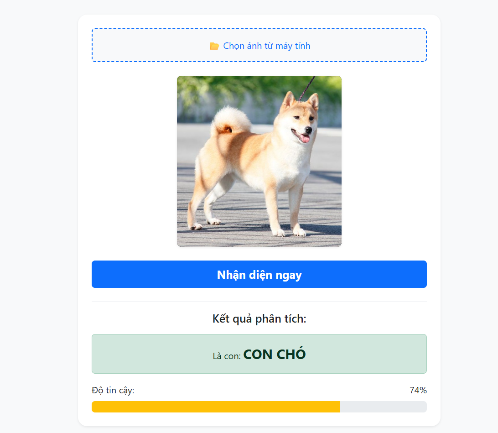
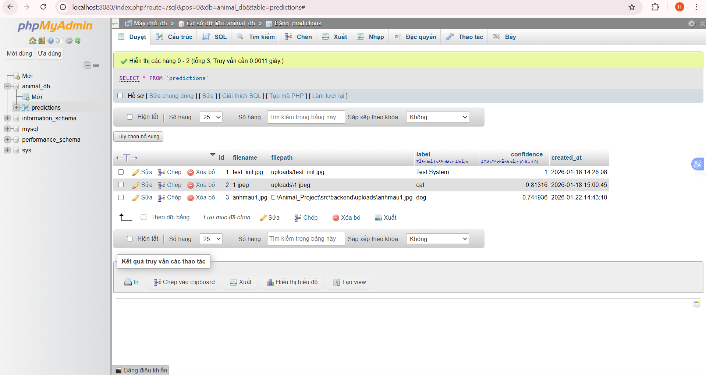

# Báo cáo Tiến độ Tuần 4 (15/01 - 21/01/2026)

**Họ và tên sinh viên:** Nguyễn Mạnh Hiếu

**Nội dung:** Xây dựng Giao diện (Frontend) và Tích hợp toàn hệ thống.

## 1. Các công việc đã hoàn thành

### Xây dựng Giao diện người dùng (Frontend)
* **Công nghệ:** HTML5, CSS3, Bootstrap 5, JavaScript (Fetch API).
* **Các chức năng đã hiện thực:**
    * Giao diện Upload ảnh thân thiện, hỗ trợ xem trước (Preview) ảnh.
    * Hiệu ứng Loading khi chờ Server xử lý.
    * Hiển thị kết quả nhận diện rõ ràng (Tên loài vật + Thanh phần trăm độ tin cậy).
    * Xử lý các trường hợp lỗi (không chọn file, mất kết nối Server).
    

### Tích hợp Backend & API
* Cấu hình Flask Server (`server.py`) để phục vụ các file giao diện tĩnh (Static Files).
* Kết nối thành công API `/predict` với Frontend.
* Đảm bảo luồng dữ liệu hoạt động trơn tru: **Client (Web) -> Backend -> AI Model -> Database**.

### Quản trị Cơ sở dữ liệu
* Cập nhật `docker-compose.yml` để tích hợp công cụ quản trị **phpMyAdmin**.
* Cấu hình liên kết mạng (Network) giữa MySQL và phpMyAdmin trong môi trường Docker.
* Đã kiểm tra và xác thực dữ liệu được lưu trữ chính xác thông qua giao diện web quản trị (`localhost:8080`).

## 2. Kết quả đạt được
* **Mã nguồn Frontend:** Bộ source code tại thư mục `src/frontend/` (`index.html`, `style.css`, `script.js`).
* **Mã nguồn Backend:** File `src/backend/server.py` đã cập nhật logic phục vụ Web.
* **Cấu hình hệ thống:** File `docker-compose.yml` phiên bản mới kèm phpMyAdmin.
* **Sản phẩm chạy thực tế:** Website hoạt động ổn định tại `http://localhost:5000`, nhận diện và lưu kết quả chính xác vào Database.

## 3. Kế hoạch tuần tiếp theo (Tuần 5)
* Xây dựng Dashboard "Lịch sử nhận diện" để hiển thị danh sách các lần dự đoán từ Database lên Web.
* Tích hợp biểu đồ thống kê (Tỉ lệ % các loài động vật đã nhận diện).
* Hoàn thiện UX/UI và kiểm thử toàn bộ hệ thống.